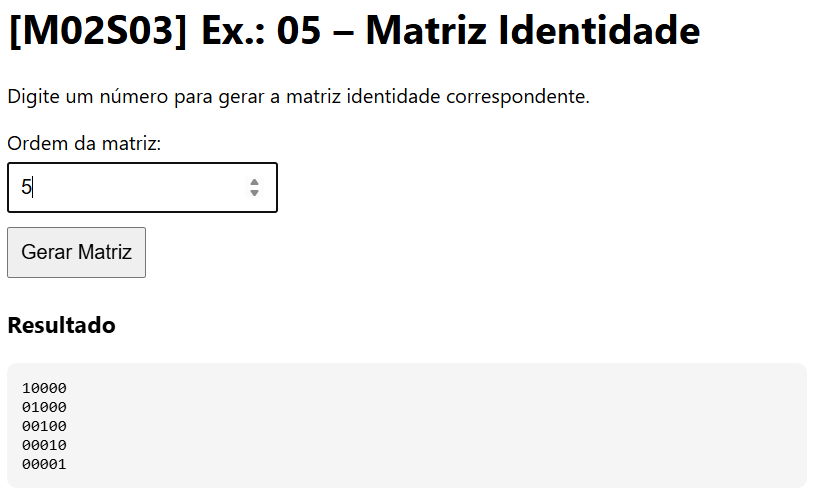

# [M02S03] Ex.: 05 – Matriz Identidade

Gera e exibe no **console** e na tela a matriz identidade de ordem **N**, onde a diagonal principal é composta por `1` e os demais elementos por `0`.

### Exemplos
- Entrada: 2  
  Saída:
10
01
- Entrada: 3  
  Saída:
100
010
001
- Entrada: 4  
  Saída:
1000
0100
0010
0001
- Entrada: 5  
  Saída:
10000
01000
00100
00010
00001

### Como executar
1. Abra `index.html` em um navegador.  
2. Digite um número inteiro positivo.  
3. Clique em **Gerar Matriz**.  
4. O resultado aparecerá na tela e também no **console**.

